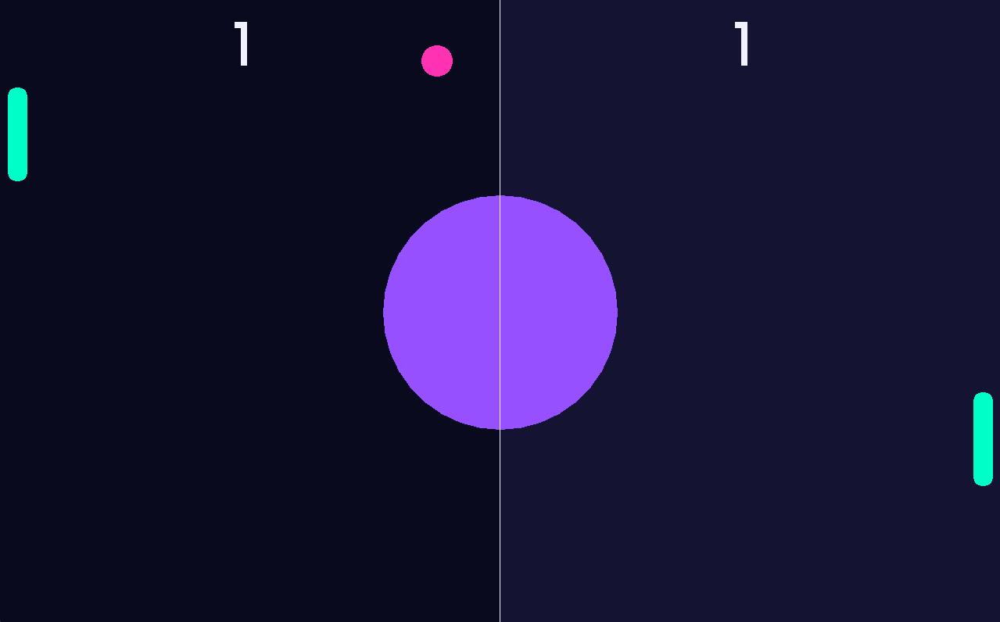

# Pong Game

A simple Pong game implemented in C++ using [raylib](https://www.raylib.com/).

## Features

- Classic Pong gameplay: Player vs CPU
- Modern color palette
- Smooth paddle and ball movement
- Score tracking

## Gameplay Screenshots

Below is a screenshot of the game in action:



## Requirements

- [raylib](https://www.raylib.com/) library
- C++ compiler (e.g., g++, MSVC)

## How to Build & Run

1. **Clone the repository:**
   ```sh
   git clone https://github.com/AtharvaG1400/pong.git
   cd pong
   ```

2. **Build the game:**
   - Using Makefile (if you have `make`):
     ```sh
     make
     ```
   - Or compile manually:
     ```sh
     g++ main.cpp -o main.exe -lraylib -lopengl32 -lgdi32 -lwinmm
     ```

3. **Run the game:**
   ```sh
   ./main.exe
   ```

## Controls

- **Up Arrow:** Move paddle up
- **Down Arrow:** Move paddle down

## License

See [LICENSE.txt](LICENSE.txt) for details.

